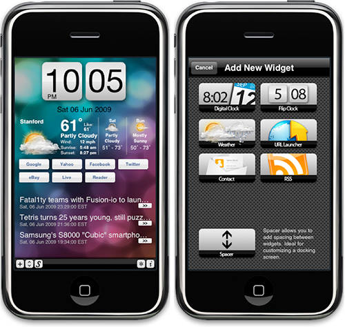

TodayScreen was created as a way to bring extensible widgets akin to Windows 7 live tiles to the iPhone.

The iPhone lacks "glance-able" information that allows users on the move to quickly pull out their phone and check things that are important to them. A user who wants to check new messages/emails will have to click on the messaging and email apps; to check news, will have to launch the news app; to check weather, will have to see the weather app; etc. TodayScreen attempts to solve the problem of having to launch different apps to check different things. The app allows user to add most common widgets on a screen so that user can quickly be informed of the latest information.

TodayScreen is licensed under the MIT license. Feel free to do anything you would like with the code in open-source, commercial projects or what have you. If you do end up using the code, we would appreciate a line at shravan [at] cs [dot] stanford [dot] edu

MIT LICENSE
=================================================
Copyright (c) 2011 Shravan Reddy, Lo Min Ming

Permission is hereby granted, free of charge, to any person obtaining a copy of this software and associated documentation files (the "Software"), to deal in the Software without restriction, including without limitation the rights to use, copy, modify, merge, publish, distribute, sublicense, and/or sell copies of the Software, and to permit persons to whom the Software is furnished to do so, subject to the following conditions:

The above copyright notice and this permission notice shall be included in all copies or substantial portions of the Software.

THE SOFTWARE IS PROVIDED "AS IS", WITHOUT WARRANTY OF ANY KIND, EXPRESS OR IMPLIED, INCLUDING BUT NOT LIMITED TO THE WARRANTIES OF MERCHANTABILITY, FITNESS FOR A PARTICULAR PURPOSE AND NONINFRINGEMENT. IN NO EVENT SHALL THE AUTHORS OR COPYRIGHT HOLDERS BE LIABLE FOR ANY CLAIM, DAMAGES OR OTHER LIABILITY, WHETHER IN AN ACTION OF CONTRACT, TORT OR OTHERWISE, ARISING FROM, OUT OF OR IN CONNECTION WITH THE SOFTWARE OR THE USE OR OTHER DEALINGS IN THE SOFTWARE.